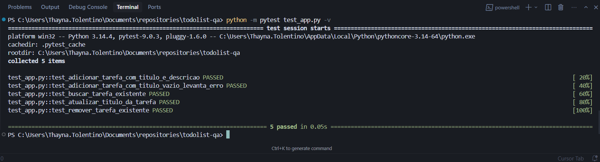
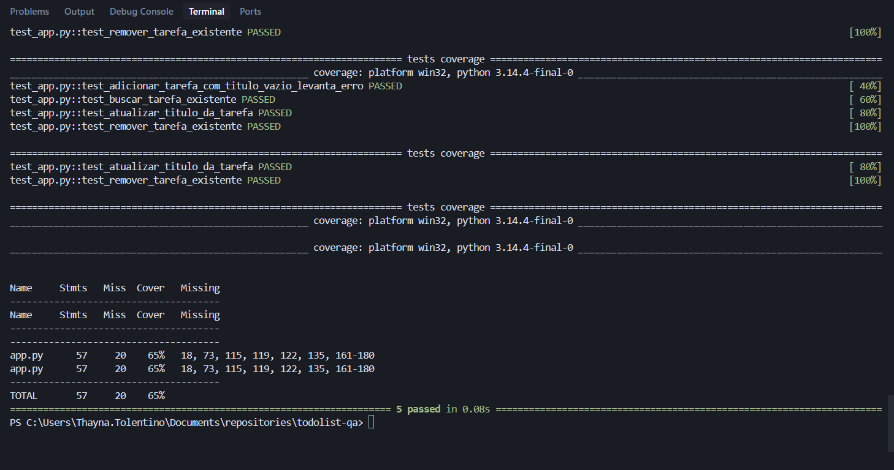

# To-Do List — Gerenciador de Tarefas

Projeto em Python puro que implementa a lógica de negócio de um **Gerenciador de Tarefas (To-Do List)** com operações CRUD completas, acompanhado de uma suíte de **testes unitários** com cobertura de código.

## Funcionalidades

| Operação | Método | Descrição |
|----------|--------|-----------|
| **Create** | `adicionar_tarefa(titulo, descricao)` | Adiciona uma nova tarefa |
| **Read** | `buscar_tarefa(id)` / `listar_tarefas()` | Busca por ID ou lista todas |
| **Update** | `atualizar_tarefa(id, ...)` / `marcar_concluida(id)` | Atualiza campos ou marca como concluída |
| **Delete** | `remover_tarefa(id)` | Remove uma tarefa pelo ID |


## Instalação das Dependências

Instale o `pytest` (framework de testes) e o `pytest-cov` (plugin de cobertura):

```bash
pip install pytest pytest-cov
```

## Como Executar a Aplicação

```bash
python app.py
```

## Como Executar os Testes

Rodar os testes:

```bash
python -m pytest test_app.py -v
```

Rodar os testes com relatório de cobertura:

```bash
python -m pytest test_app.py -v --cov=app --cov-report=term-missing
```

## Resultados dos Testes

### Testes unitários


### Relatório de cobertura


## Regras de Negócio Testadas

| # | Regra de Negócio | Tipo | Teste |
|---|-----------------|------|-------|
| 1 | Deve ser possível criar uma tarefa com título e descrição, com status inicial pendente (`concluida=False`) | Sucesso | `test_adicionar_tarefa_com_titulo_e_descricao` |
| 2 | Não deve permitir criar tarefa com título vazio — deve lançar `ValueError` | Falha | `test_adicionar_tarefa_com_titulo_vazio_levanta_erro` |
| 3 | Deve retornar a tarefa correta ao buscar por um ID existente | Sucesso | `test_buscar_tarefa_existente` |
| 4 | Deve atualizar apenas o título da tarefa, mantendo os demais campos inalterados | Sucesso | `test_atualizar_titulo_da_tarefa` |
| 5 | Deve remover a tarefa da lista e ela não deve mais existir após a remoção | Sucesso | `test_remover_tarefa_existente` |

